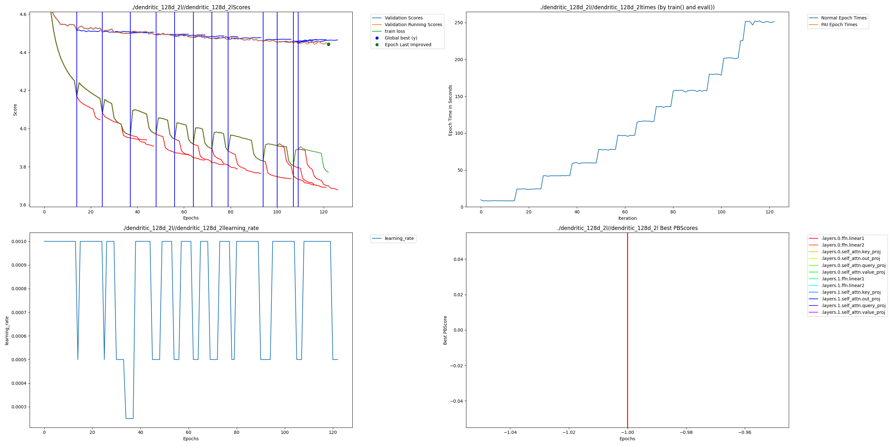

# Dendritic vs Vanilla Transformer Comparison

A head-to-head comparison between standard Transformer language models and dendritic-enhanced models using PerforatedAI's artificial dendrites technology.

## Project Structure

```
PerforatedAI/
├── requirements.txt          # Python dependencies
├── README.md                # This file
├── test_setup.py            # Environment verification script
├── data_preparation.py      # Dataset loading and preprocessing
├── model.py                 # Transformer model definitions
├── train.py                 # Unified training script
├── run_experiment.sh        # Automated experiment runner
└── TECHNICAL_REPORT.md      # Comprehensive analysis and results
```

## Setup

### 1. Environment Setup

```bash
# Create virtual environment
python3 -m venv venv
source venv/bin/activate  # On Mac/Linux

# Install dependencies
pip install -r requirements.txt

# Verify installation (optional but recommended)
python test_setup.py

# Login to W&B for experiment tracking
wandb login
```

### 2. Hardware Configuration

This project is designed for Apple Silicon (M-series) Macs with MPS backend support. The code automatically detects and uses the best available device (MPS > CUDA > CPU).

## Running Experiments

### Option 1: Use the automated script 

**Quick experiment (3 epochs):**
```bash
./run_experiment.sh quick
```

**Full experiment (10 epochs):**
```bash
./run_experiment.sh full
```

This will automatically:
1. Train the vanilla model
2. Train the dendritic model
3. Log results to W&B

### Option 2: Manual training

**Train vanilla model:**
```bash
python train.py --model_type vanilla 
```

**Train dendritic model:**
```bash
python train.py --model_type dendritic 
```

### Key Arguments

- `--model_type`: Choose between 'vanilla' or 'dendritic'
- `--epochs`: Number of training epochs (default: 10)
- `--embed_dim`: Model embedding dimension (default: 256 for vanilla, 128 for dendritic)
- `--num_layers`: Number of transformer layers (default: 2)
- `--batch_size`: Training batch size (default: 32)
- `--seq_length`: Sequence length for training (default: 50)
- `--learning_rate`: Initial learning rate (default: 1e-3)
- `--wandb_project`: W&B project name (default: 'dendritic-transformer-comparison')

## Dataset

We use **WikiText-2**, a word-level language modeling dataset with ~2 million tokens. The dataset is automatically downloaded via Hugging Face's `datasets` library.

## Example Output
This shows an example output of an experiment with 128 width, 2 layers, and dropout of 0.25



Perplexity metrics as dendrites are added:

| Param Count | Val Perplexity/100 |
|-------------|--------------------|
| 3,362,064  | 0.941487          |
| 3,759,888  | 0.903227          |
| 4,164,624  | 0.898944          |
| 4,573,968  | 0.883500          |
| 4,987,920  | 0.878257          |
| 5,406,480  | 0.870242          |
| 5,829,648  | 0.867079          |
| 6,257,424  | 0.864259          |
| 6,689,808  | 0.864074          |
| 7,126,800  | 0.858331          |
| 7,568,400  | 0.855874          |
| 8,014,608  | 0.853706          |
| 8,465,424  | 0.852553          |
| 8,920,848  | 0.852192          |
| 9,380,880  | 0.851571          |
| 9,845,520  | 0.848186          |
| 10,314,768 | 0.841401          |

Take note on this graph, it does seem like the training scores would be going down anyway without dendrites.  However, at each dendritic addition you can see the extended blue lines showing the validation scores that were calculated before loading the previously best model and adding dendrites to that one.  It is clear that the dendritic addition is in fact what is enabling the increased training scores too actually improve validation error, and not just overfit the data.  From the starting point reducing perplexity from .941 to .841 is an **11%** improvement in perplexity.


