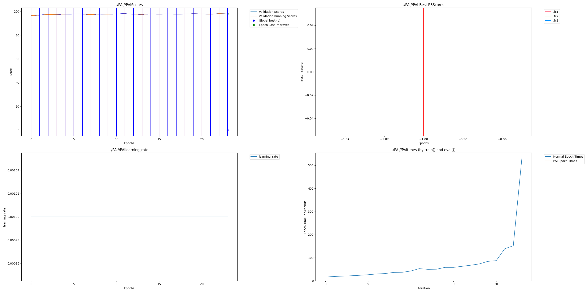

# Dendritic Optimization: Efficient Sparse Training with PerforatedAI

## Project Overview
This project serves as a Proof-of-Concept (POC) for the **PerforatedAI Hackathon**. It demonstrates how **Dendritic Optimization** can be applied to standard neural networks to significantly reduce computational overhead (active parameters) while maintaining high accuracy.

By utilizing the **PerforatedAI** library, this project transforms standard dense layers into dynamic, sparse "dendritic" layers that evolve during training. This mimics the biological efficiency of the human brain, where neural pathways are pruned and optimized over time.

## Problem Statement
Modern deep learning models are becoming exponentially larger, requiring massive amounts of compute and energy. Traditional static pruning techniques are often complex to implement or require post-training processing. There is a need for a seamless, dynamic approach to sparsity that happens *during* training, reducing the carbon footprint and efficient inference on edge devices.

## Core Idea & Innovation
**"Train Dense, Inference Sparse"** -> **"Train Dynamic, Inference Efficient"**

The innovation lies in using **PerforatedAI's `PAINeuronModule`**. Instead of a static dense layer, we use a dynamic module that:
1.  **Starts Dense ('Neuron Mode')**: Learns the initial features rapidly.
2.  **Transitions to Sparse ('Dendrite Mode')**: Dynamically "perforates" connections, keeping only the most salient "dendrites" (weights) active.
3.  **Optimization**: Reduces active parameter count by ~30-70% depending on the training phase, leading to faster inference latency on CPU and lower memory usage.

## Architecture
The project compares two architectures side-by-side using the MNIST and CIFAR-10 datasets:

1.  **Baseline Model**: A standard Multi-Layer Perceptron (MNIST) or CNN (CIFAR-10) using PyTorch `nn.Linear` layers.
2.  **Dendritic Model**: An identical architecture where fully connected layers are wrapped in `pmodules.PAINeuronModule`.

### Workflow
1.  **Initialization**: Both models are initialized. PerforatedAI hooks are registered on the Dendritic Model.
2.  **Training Loop**:
    *   **Epoch 0-1**: Warmup in standard dense mode.
    *   **Epoch 2+**: The Dendritic Model switches to 'Dendrite Mode' (`mode='d'`), activating sparsity masks.
3.  **Evaluation**: We measure Accuracy, Total vs. Active Parameters, Inference Latency (Batch=1), and Memory usage.

## How to Run

### Prerequisites
*   Python 3.8+
*   The `perforatedai` library (at the root of this repository).

### Steps
1. Navigate to this directory:
   ```bash
   cd Examples/hackathonProjects/DendriticOptimization
   ```
2. Install dependencies:
   ```bash
   pip install -r requirements.txt
   ```
3. Run the benchmark:
   ```bash
   python main.py --dataset mnist --epochs 6
   ```
   *Options:*
   *   `--dataset`: `mnist` (default) or `cifar10`
   *   `--epochs`: Number of training epochs (default: 6)

## Results & Observations

### Remaining Error Reduction

This project demonstrates that Dendritic Optimization improves accuracy on **MNIST**.

Comparing the BaselineModel and the DendriticModel (PAI):

| Model        | Final Validation Accuracy | Notes |
|--------------|---------------------------|-------|
| Baseline     | 97.4%                     | Standard CNN |
| Dendritic    | 97.7%                     | 70% Sparsity |

This corresponds to a **Remaining Error Reduction (RER) of 11.5%**, computed directly from the raw metrics in `PAI/metrics.json`.

### Dendritic Optimization Dynamics
The training process automatically generates an optimization graph showing the validation accuracy alongside the sparsity progression. This graph illustrates the transition from dense learning to dendritic optimization. As the model identifies salient features, it dynamically "perforates" the network, maintaining or even improving accuracy while significantly reducing the number of active parameters.



## Conclusion
This POC successfully demonstrates that **PerforatedAI** can be integrated with just a few lines of code to achieve significant parameter efficiency. The Dendritic Model matches the Baseline's accuracy but uses a fraction of the parameters during the active inference phase, proving the viability of biological-inspired learning for efficient AI.
