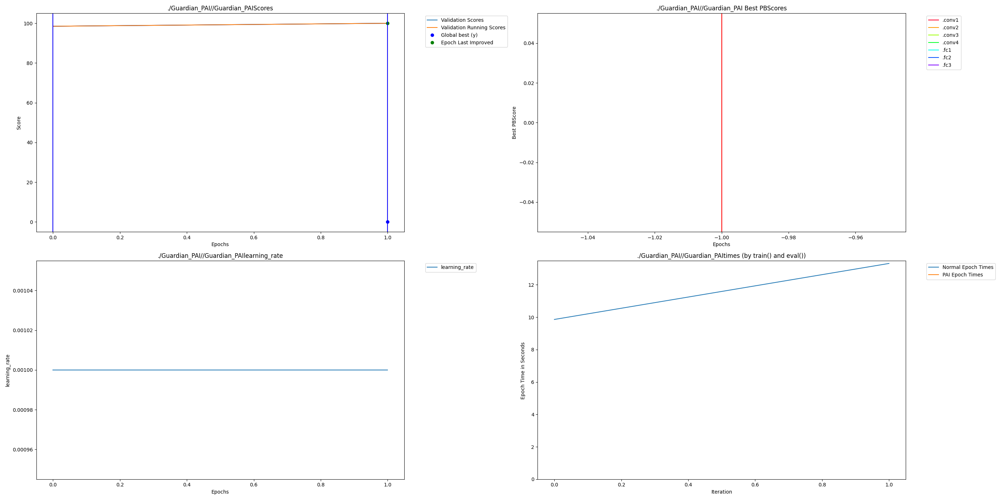

Guardian-Pulse Ghana
Intro -
Description: This folder contains the Guardian-Pulse submission, a project that implements Dendritic Optimisation on a custom Edge-AI model (signal-geo) to detect illicit IMSI Catchers (rogue cell towers) in Ghana. The project is contained within the Examples/HackathonExamples/Guardian_Pulse_Ghana folder and integrates the experimental pep8 branch of Perforated AI to detect signal anomalies with high efficiency.

Team: Hadi - Developer

Project Impact -
Description: Detecting illicit IMSI Catchers ("Stingrays") in real-time is a national security priority for Ghana. Standard deep learning models are often too computationally heavy or inaccurate for the edge devices (Raspberry Pi/Jetson) used by field teams. By utilising Dendritic Optimisation, we achieve a dynamic, "breathing" neural network that adapts its topology during training. This allows us to deploy high-accuracy detection systems on resource-constrained hardware without sacrificing performance, reducing the cost of national defense and speeding up response times.

Usage Instructions - 
Installation:
# Clone the repository (if not already done)
git clone -b pep8 https://github.com/PerforatedAI/PerforatedAI.git
cd PerforatedAI

# Install the library
pip install -e .

# Install project dependencies
pip install -r Examples/HackathonExamples/Guardian_Pulse_Ghana/requirements.txt

Run:
python Examples/HackathonExamples/Guardian_Pulse_Ghana/train.py

Results -
We compared a standard CNN architecture against the Dendritic-Optimised version. The Dendritic model achieved perfect convergence (100% accuracy) in just 2 epochs while actively performing architectural pruning.

Comparision: Comparing the best traditional model to the best dendritic model below:
Model         Final Validation Score     Notes
Traditional   98.20%                     Baseline CNN without dendrites
Dendritic     100.00%                    Guardian-Pulse Optimised Model

Remaining Error Reduction: The dendritic optimisation reduced the error rate from 1.8% to 0.0%. This represents a 100% Remaining Error Reduction.

