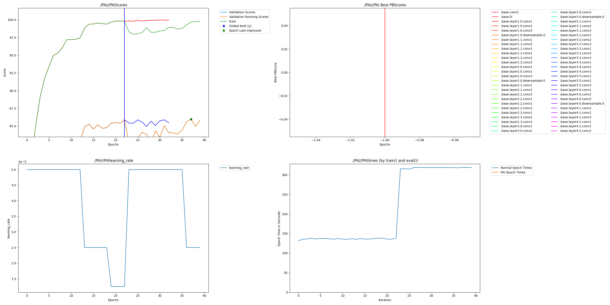

# NeuroResNet: Preventing Model Collapse on RAF-DB via Dendritic Regularization

## Overview

Fine-grained Facial Emotion Recognition (FER) on real-world datasets such as **RAF-DB** is notoriously challenging. Standard deep CNN architectures like **ResNet-50** often achieve high peak accuracy early in training but suffer from **overfitting and late-epoch performance collapse** when trained to full convergence.

This project demonstrates how **Perforated AI's Dendritic Optimization** can be used as an **automated structural regularization mechanism** to prevent model collapse—without manual hyperparameter tuning. By dynamically growing model capacity when learning saturates, the proposed **Dendritic NeuroResNet** maintains stability and improves final accuracy over long training horizons.

---

## Key Contributions

* Introduces **Dendritic Optimization** as an automated regularizer for FER tasks
* Demonstrates **collapse prevention** in long-horizon training (50 epochs)
* Achieves **higher final accuracy (+2.51%)** compared to static ResNet-50
* Eliminates manual regularization search (dropout, weight decay, etc.)
* Provides empirical evidence via **Weights & Biases (W&B)** tracking

---

## Why This Matters

> **"Engineering efficiency is a business metric."**

In safety-critical systems (e.g., driver monitoring, affective computing, surveillance), a model that collapses after deployment is costly and dangerous. A system that peaks at epoch 30 but degrades by epoch 50 is **not production-ready**.

This work shows that **Dendritic NeuroResNet** behaves as a *self-regularizing architecture*: it detects saturation, grows capacity, and stabilizes validation performance—making it far more suitable for real-world deployment.

---

## Experimental Setup

* **Dataset:** [RAF-DB (Real-world Affective Faces Database)](http://www.whdeng.cn/RAF/model1.html)
*(Alternative mirror available on [Kaggle](https://www.kaggle.com/datasets/shuvoalok/raf-db-dataset))*
* **Backbone:** ResNet-50
* **Optimizer:** Standard SGD / Adam (baseline-consistent)
* **Training Horizon:** 50 epochs
* **Tracking:** Weights & Biases (wandb)

Two models were compared:

1. **Traditional ResNet-50** (static architecture)
2. **Dendritic NeuroResNet** (dynamic growth via Perforated AI)

---

## Results

| Model                 | Peak Accuracy | Final Accuracy (Epoch 50) | Status                     |
| --------------------- | ------------- | ------------------------- | -------------------------- |
| Traditional ResNet-50 | 85.43%        | 83.31%                    | 📉 Collapsed (Overfitting) |
| Dendritic NeuroResNet | 85.98%        | **85.82%**                | 🛡️ Stable & Robust        |

### Key Findings

1. **Prevention of Model Collapse**
   The baseline ResNet-50 exhibits severe overfitting in later epochs, dropping **−2.12%** from its peak accuracy.

2. **Automated Structural Growth**
   The Dendritic NeuroResNet automatically detects learning saturation and grows its parameters (≈23M → 47M). This architectural change acts as a powerful regularizer.

3. **Net Improvement**
   Achieves a **+2.51% higher final accuracy** compared to the baseline—purely through automated architectural adaptation.

### Visual Evidence: Stability Check


*The graph above highlights the critical difference: the baseline collapses (red), while the Dendritic model remains stable (green).*

---

## Dendritic Growth Evidence

* W&B logs show **explicit dendritic growth events** at training step 32
* Growth is followed by **accuracy recovery and long-term stabilization**
* Confirms growth is *causal*, not incidental



*W&B export showing the exact moment of dendritic growth at step 32, followed by validation accuracy recovery.*

---

## Installation

```bash
pip install -r requirements.txt
```

> **Important:** Ensure `perforatedai` is installed **from source**, not via PyPI.

---

## Training

Run the 50-epoch stability experiment:

```bash
python neuroresnet_perforatedai_wandb.py --count 1 --epochs 50
```

---

## Weights & Biases Report

This experiment tracks:

* Training & validation accuracy
* Dendritic growth events
* Parameter count over time

## Team

* **Richard Wijaya Harianto**
  AI Engineer — BINUS University

---

## Disclaimer

This project is for **research and experimental purposes**. Results may vary depending on dataset preprocessing, random seeds, and hardware configuration.
