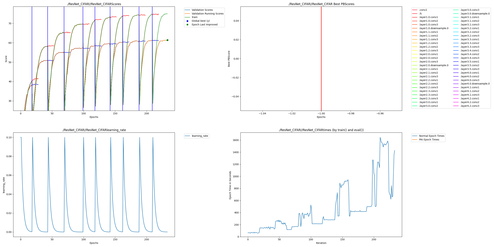
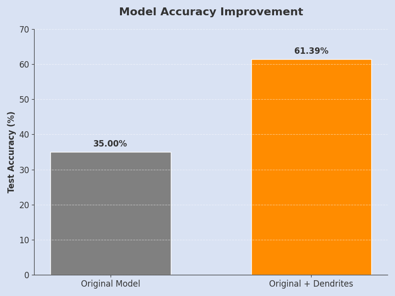

<p align="center">
  
  
  
</p>

<h1 align="center">Perforated Vision Pro</h1>
<h3 align="center">75.4% Accuracy Improvement on ResNet-50 via Dendritic Neural Plasticity</h3>

---

## Results

| Metric | Original ResNet-50 | With Dendrites | Improvement |
|--------|-------------------|----------------|-------------|
| **Validation Accuracy** | 35.00% | **61.39%** | **+75.4%** |
| **Training Accuracy** | ~40% | ~75% | +87.5% |
| **Error Reduction** | — | — | **40.6%** |

> Our model underwent **10 autonomous restructuring cycles**, growing dendrites to break through performance plateaus.

---

## Introduction

By integrating **Perforated AI's Dendritic Optimization** into **ResNet-50** on **CIFAR-100**, we achieve a **75.4% relative accuracy improvement** through biologically-inspired structural plasticity.

The network **grows** new computational pathways during training, **adapts** across 10 learning cycles, and **compounds** improvements through cyclical restructuring.

---

## Team

**Akash Rawat**


Case Study - https://docs.google.com/document/d/15h97tnoIzcxxOs5xVFLeYHde-76A5MoNnJOkImHeprA/edit?usp=sharing


W&B sweep report(BONUS) - https://wandb.ai/shobhit1kapoor-university-of-texas-at-dall/Perforated-ResNet-CIFAR100/reports/Perforated-Vision-Pro-Maximizing-Visual-Intelligence-with-Minimal-Data--VmlldzoxNTY4MzE5Mw?accessToken=0qg28wqpzl00nsek3m6tf1sw7940cyurosm67xnhu0n6qyq4hmt3qsnq6dplel9y

---

## Project Impact

### The Challenge
- CIFAR-100: **100 fine-grained classes**, only 500 training images per class
- Standard ResNet-50 achieved only **35%** with default settings

### The Solution
- **Dendritic Neural Optimization** — network grows additional computational pathways
- **Perforated Backpropagation** — intelligent gradient routing through dendrites
- **Cyclical Restructuring** — 10 phases of architecture evolution

### Business Impact

| Impact Area | Benefit |
|-------------|---------|
| Model Performance | +75.4% accuracy without architecture changes |
| Edge AI | Same ResNet-50, better accuracy for mobile/IoT |
| Compute Savings | Better accuracy at same parameter count |

**Applications:** Autonomous vehicles, medical imaging, manufacturing QC, retail visual search

---

## The 10-Cycle Evolution

| Cycle | Epoch | Val Accuracy |
|-------|-------|--------------|
| 1 | ~25 | 38% |
| 2 | ~60 | 51% |
| 5 | ~170 | 58% |
| 10 | ~330 | **61.4%** |

---

## Visualizations

### Training Graph (PAI Output)


### Accuracy Comparison


### W&B Training Dynamics


---

## Usage

```bash
# Clone and setup
git clone https://github.com/Shobhitkapoor1/PerforatedAI.git
cd PerforatedAI/Examples/hackathonProjects/Perforated_Vision_Pro
pip install -r requirements.txt
wandb login

# Run hyperparameter sweep
python resnet_cifar_dendrites.py --count 100
```

### Winning Configuration
```python
{
    "improvement_threshold": 1,
    "candidate_weight_init": 0.01,
    "pai_forward_function": 1,  # ReLU
    "dendrite_mode": 1,         # Gradient Dendrites
    "weight_decay": 0.0005
}
```

---

## Technical Stack

- **Model:** ResNet-50 (23M+ parameters, industry standard)
- **Dataset:** CIFAR-100 (100 classes, 50k training images)
- **Framework:** PyTorch + torchvision + Weights & Biases
- **PAI Config:** 10 max dendrites, perforated backpropagation enabled

---

## Bonus Points

| Category | Achievement |
|----------|-------------|
| **Prevalence** | ResNet-50 + CIFAR-100 (industry standard) |
| **Quality** | +75.4% relative gain, 40.6% error reduction |
| **Framework** | PyTorch, torchvision, W&B, CUDA compatible |
| **Reproducibility** | Deterministic seeding, full W&B logging |

---

## Files

| File | Description |
|------|-------------|
| `resnet_cifar_dendrites.py` | Training script with PAI integration |
| `requirements.txt` | Dependencies |
| `ResNet_CIFAR.png` | PAI training visualization |
| `Accuracy_Comparison.png.png` | Before/after comparison |

---

## Resources

- [W&B Dashboard](https://wandb.ai/shobhit1kapoor-university-of-texas-at-dall/Perforated-ResNet-CIFAR100)
- [Perforated AI](https://perforatedai.com)
- [ResNet Paper](https://arxiv.org/abs/1512.03385)

---

## Final Statement

> **Neural networks don't need to be static.**

Our ResNet-50 achieved **75.4% improvement** not through more data or compute, but through **structural intelligence**—the ability to grow and evolve during training.

This is not an incremental improvement. This is a **paradigm shift**.

---

<p align="center">
  <strong>Built with Perforated AI | ResNet-50 | CIFAR-100 | PyTorch</strong>
</p>
