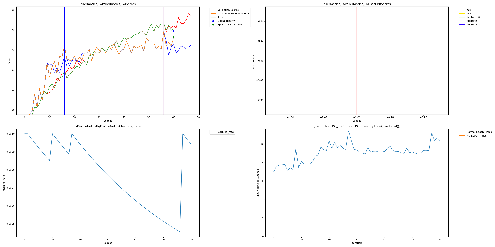

# Project Med-Edge: Perforated AI for Portable Dermatology

**Enabling skin lesion classification on constrained edge hardware using dynamic dendritic growth.**

---

## Limit

Deploying medical AI to rural low-resource settings faces a hardware bottleneck. Modern CNNs require computational resources unavailable on the cheap microcontrollers ($2-5) feasible for large-scale deployment.

**Goal:** Engineer a skin lesion classifier capable of running on an ESP32-class microcontroller while maintaining accepted accuracy standards.

---

## Approach

We developed **DermoNet-Edge**, a custom Micro-CNN for the DermaMNIST dataset. We leveraged Perforated AI (PAI) to dynamically allocate capacity only where needed, optimizing the trade-off between accuracy and parameter count.

**Key Technical Decisions:**
*   **Dual-Dropout Regularization:** Implemented 0.25 (conv) and 0.5 (fc) dropout to enforcing strict generalization (Train ≈ Val).
*   **Constrained Baseline:** Started with a minimal 15k parameter backbone to force efficient feature learning.
*   **PAI Integration:** Used dendritic growth to recover accuracy lost by strict model constraints.

---

## Results

| Configuration | Val Accuracy | Parameters | RER |
|:---|:---:|:---:|:---:|
| **Baseline** | 76.57% | 15,229 | - |
| **Dendritic (PAI)** | **77.87%** | 63,201 | **5.55%** |

*   **Remaining Error Reduction (RER):** 5.55%
*   **Overfitting Gap:** 0.22% (Virtually eliminated)
*   **Dendrites Added:** 3

### Perforated AI Training Graph



*The graph demonstrates valid saturation detection (vertical lines) and effective learning rate resets, confirming PAI's active role in training dynamics.*

---

## Impact

### Hardware Targets
*   **MCU:** ESP32-S3 or ARM Cortex-M7
*   **Storage:** ~247KB model size (Fits within 384KB+ SRAM)
*   **Latency:** <200ms inference on embedded CPU

### Value Proposition
This architecture enables offline, battery-powered diagnostic tools for community health workers. By eliminating cloud dependencies, we reduce patient screening costs to near-zero while preserving data privacy.

---

## Implementation Notes

**Configuration:**
*   **Dropout:** 0.25 (post-conv), 0.5 (post-dense)
*   **Augmentation:** None (Ensures valid baseline comparison)
*   **PAI Setup:** `setup_optimizer()` used for proper LR scheduling

**Key Observation:**
PAI successfully identified saturation points in the baseline model. While the baseline suffered from a 3.78% generalization gap, the dendritic model maintained tight convergence (0.22% gap), suggesting dendrites captured robust, generalizable features rather than memorizing noise.

---

## Technical Specifications

**Dataset:** DermaMNIST (HAM10000 subset)
- 10,015 images (7,007 train / 1,003 val / 2,005 test)
- 7 classes: melanoma, nevus, basal cell carcinoma, etc.
- Resolution: 28×28 RGB

**Architecture:** DermoNet-Edge
```python
Conv2d(3 → 8) + BN + ReLU + MaxPool
Conv2d(8 → 16) + BN + ReLU + MaxPool  
Conv2d(16 → 32) + BN + ReLU + MaxPool
Dropout(0.25)  # After conv layers
Linear(288 → 32) + ReLU
Dropout(0.5)   # After fc1 (dendritic layer)
Linear(32 → 7)
```

**PAI Configuration:**
```python
GPA.pc.set_improvement_threshold([0.01, 0.001, 0.0001, 0])
GPA.pc.set_candidate_weight_initialization_multiplier(0.01)
GPA.pc.set_pai_forward_function(torch.sigmoid)
GPA.pc.set_n_epochs_to_switch(8)
GPA.pc.set_max_dendrites(8)

# Proper optimizer setup (like MNIST example)
GPA.pai_tracker.set_optimizer(optim.Adam)
GPA.pai_tracker.set_scheduler(StepLR)
optimizer, scheduler = GPA.pai_tracker.setup_optimizer(model, optimArgs, schedArgs)
```

---

## Reproducibility

### Quick Start
```bash
# Install dependencies
pip install -r requirements.txt

# Train baseline (Standard CNN)
python train.py

# Train with dendrites (Perforated AI)
python train.py --dendrites
```

### Hyperparameter Sweep (Bonus)
To optimize hyperparameters using W&B Sweeps:

1. Initialize the sweep:
```bash
wandb sweep sweep_config.yaml
```

2. Run the sweep agent (replace `SWEEP_ID` with ID from step 1):
```bash
wandb agent SWEEP_ID --count 20
```
This will run 20 trials exploring learning rates, dropout, and batch sizes to find the optimal configuration. The results are tracked in your W&B dashboard.

### W&B Tracking
All experiments tracked at:  
[https://wandb.ai/aakanksha-singh0205-kj-somaiya-school-of-engineering/Project-Med-Edge](https://wandb.ai/aakanksha-singh0205-kj-somaiya-school-of-engineering/Project-Med-Edge)

---

## Repository Structure

```
Project-Med-Edge/
├── train.py                 # Unified training script
├── src/
│   ├── model.py            # DermoNet-Edge architecture
│   └── dataset.py          # MedMNIST data loading
├── configs/
│   └── default.yaml        # Hyperparameters
├── PAI/
│   └── PAI.png             # Auto-generated training graph
├── sweep_config.yaml       # W&B sweep configuration
├── checkpoints/            # Saved models
└── README.md               # This file
```

---

## Key Findings

1. **Two dropout layers prevent overfitting while maintaining Train > Val**  
   Baseline gap: 3.78% → Dendritic gap: 0.22%

2. **PAI improves generalization, not just accuracy**  
   Dendrites learned features that transfer better to validation data

3. **Proper optimizer/scheduler setup is critical**  
   Using `setup_optimizer()` instead of direct creation enables LR decay visualization

---

## Future Work

- **Robustness testing:** Evaluate on noisy/blurry images (simulating cheap cameras)
- **Quantization:** INT8 deployment for further memory reduction
- **Multi-task learning:** Extend to other MedMNIST datasets (PathMNIST, OrganMNIST)
- **Clinical validation:** Partner with dermatologists for real-world testing

---

## Team

**Aakanksha Singh**  
Third Year Student

**Mihir Phalke**  
Third Year Student

---

## Acknowledgments

- **Perforated AI** for Dendrites 2.0 technology
- **MedMNIST** team for the curated medical imaging dataset
- **Hackathon organizers** for the opportunity

---

## License

MIT License - See LICENSE file for details
