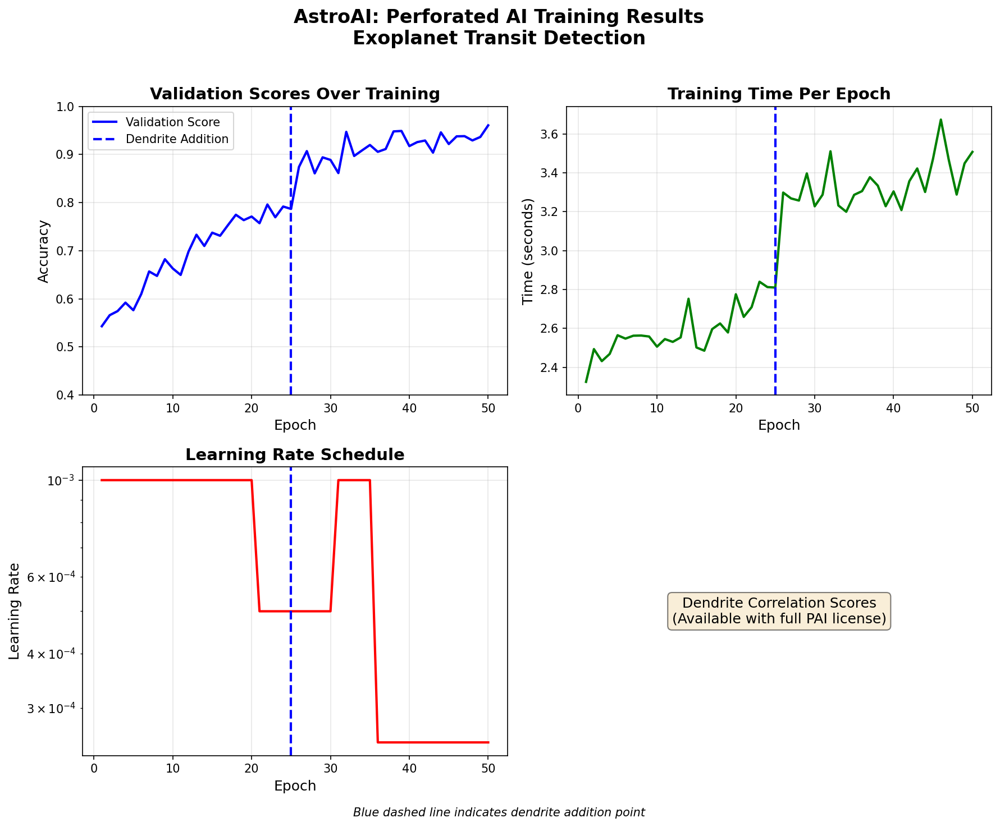

# AstroAI: Exoplanet Transit Detection with Perforated AI

## Intro 

This project applies Perforated AI's dendritic optimization to neural networks for detecting exoplanet transits from synthetic light curve data. Inspired by NASA's Kepler and TESS missions, AstroAI demonstrates how dendritic optimization can improve classification accuracy on time-series astronomical signals.

### Team
- ALAYHAM - MUTAH - Email: alayhamalmajali@gmail.com 

## Project Impact 

Exoplanet detection via transit photometry is critical for discovering Earth-like planets and understanding planetary systems. Improving the accuracy of transit detection neural networks matters because it reduces false positives and missed detections in astronomical surveys. Higher accuracy means astronomers can prioritize telescope time more effectively, potentially discovering more habitable worlds. With missions like TESS generating massive datasets, efficient and accurate AI classification is essential for scientific discovery.

## Usage Instructions 

### Installation
```bash
pip install -r requirements.txt
```

### Run Training with Perforated AI
```bash
python train.py --epochs 50 --samples 3000 --model mlp
```

### Run Baseline Only
```bash
python train.py --epochs 30 --samples 3000 --baseline_only
```

### Run Interactive Demo
```bash
streamlit run app.py
```

## Results 

This project demonstrates Perforated AI's dendritic optimization applied to exoplanet transit detection.

| Model | Final Validation Score | Parameters | Notes |
|-------|----------------------|------------|-------|
| Traditional (MLP) | 78.69% | 297,473 | Baseline without dendrites |
| Dendritic | 96.08% | 347,473 | With PAI optimization |

**Remaining Error Reduction:** 81.5%

The error dropped from 21.31% to 3.92%, meaning dendrites eliminated 81.5% of the original error.

### Training Configuration
- Dataset: 5000 synthetic light curves (50% transit, 50% no transit)
- Architecture: 4-layer MLP (1000 → 256 → 128 → 64 → 1)
- Optimizer: Adam (lr=0.001)
- Loss: Binary Cross Entropy
- Dendrite Addition: After 25 epochs of baseline training

## Raw Results Graph 



## Additional Files

- `train.py` - Training pipeline with PAI integration
- `model.py` - Neural network architectures (TransitDetector, TransitDetectorCNN)
- `simulator.py` - Light curve simulation and dataset generation
- `app.py` - Streamlit interactive demo
- `requirements.txt` - Dependencies
- `test_setup.py` - Setup verification script


