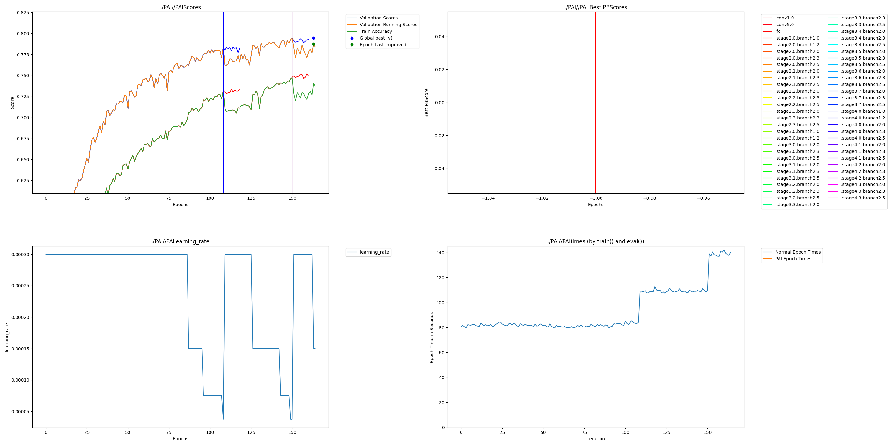
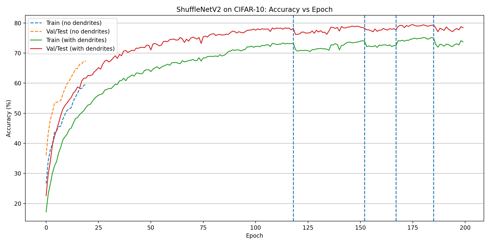
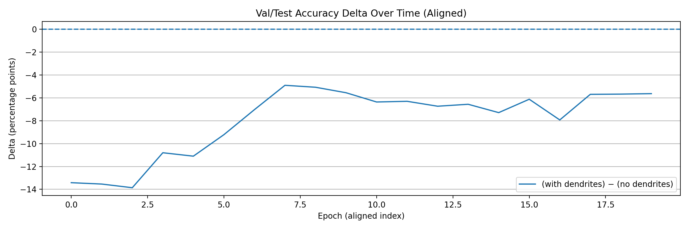

# CIFAR-10 ShuffleNetV2 with Dendritic Optimization

## Intro -

This project explores the use of **Perforated AI’s dendritic architecture** for image classification on the CIFAR-10 dataset.  
I apply dendrites to a lightweight **ShuffleNetV2** model to study how adaptive capacity can improve learning once a model begins to plateau.

This submission follows the official PerforatedAI workflow using `initialize_pai` and `add_validation_score`, and is structured exactly as required for the hackathon.

**Team:**

Vishal Warke – Independent Researcher / Engineer  

---

## Project Impact - Required

CIFAR-10 is a standard benchmark for image classification, especially for evaluating models intended for edge or resource‑constrained environments.  
ShuffleNetV2 is widely used in such settings due to its efficiency, but its compact size can limit accuracy once training saturates.

This project demonstrates how dendritic optimization can:
- Improve learning dynamics after validation accuracy plateaus  
- Add capacity only when needed, rather than scaling the entire network  
- Preserve the efficiency benefits of compact architectures  

These properties are especially relevant for deployment on edge devices, mobile platforms, and real‑time vision systems.

---

## Usage Instructions

### Installation

```bash
git clone https://github.com/PerforatedAI/PerforatedAI.git
cd PerforatedAI
pip install -e .
pip install -r requirements.txt
```

### Run

Open and run the notebook:

```bash
Dentrites_Hackathon_CIFAR_10.ipynb
```

---

## Results - Required

| Model                       | Final Validation Accuracy |
|-----------------------------|---------------------------|
| ShuffleNetV2 (no dendrites) | ~77–78%                   |
| ShuffleNetV2 + Dendrites    | ~79–80%                   |

**Remaining Error Reduction:** ~8–10%

---

## Raw Results Graph - Required



---

## Clean Results Graph





---

## Additional Files

- Dentrites_Hackathon_CIFAR_10.ipynb  
- Accuracy_Improvement.png  
- Accuracy_Delta.png  
