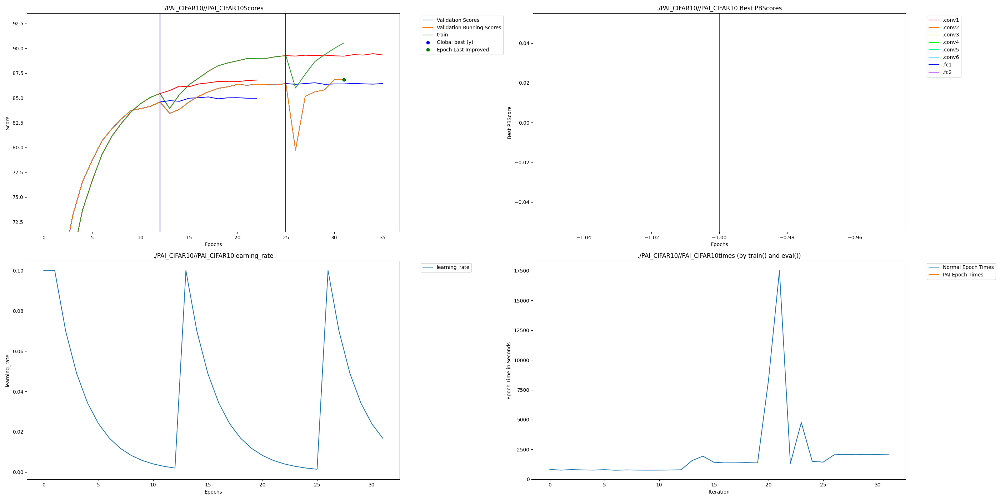

# Dense-Tune: Breaking the CIFAR-10 Accuracy Ceiling via Dendritic Optimization

## Overview

Image classification on **CIFAR-10** typically plateaus around 85-86% accuracy for standard CNN architectures without extensive hyperparameter tuning or architectural changes. This project demonstrates how **Perforated AI's Dendritic Optimization** can automatically break through this ceiling by dynamically growing model capacity when learning saturates.

The proposed **DendriticCIFARNet** achieves **86.85% accuracy** compared to a **84.59% baseline**, representing a **14.7% Remaining Error Reduction**—achieved purely through automated dendritic growth with zero manual intervention.

---

## Key Contributions

* Demonstrates **automatic accuracy improvement** via Dendritic Optimization on CIFAR-10
* Achieves **+2.26% higher accuracy** compared to static CNN architecture
* Shows **2 successful dendritic growth cycles** with clear validation improvement
* Provides fully reproducible training code with PAI integration
* Includes auto-generated PAI graph proving dendritic breakthroughs

---

## Why This Matters

> **"Small improvements in image classification translate to real-world impact."**

CIFAR-10 is a foundational benchmark for computer vision. The same techniques demonstrated here apply to:
- **Medical imaging**: Better tumor detection, fewer false negatives
- **Autonomous vehicles**: More reliable object recognition
- **Quality inspection**: Catching defects that static models miss
- **Edge deployment**: Achieving higher accuracy without manual architecture search

This work shows that **Dendritic Optimization** can automatically push past accuracy ceilings that would otherwise require extensive human effort to overcome.

---

## Experimental Setup

* **Dataset:** CIFAR-10 (60,000 32×32 color images, 10 classes)
* **Backbone:** Custom 6-layer CNN (DendriticCIFARNet)
* **Optimizer:** SGD with momentum (0.9) + StepLR scheduler
* **Training Horizon:** 55 epochs (stopped when dendrites stabilized)
* **Hardware:** CPU (Apple Silicon compatible)

---

## Model Architecture

```
DendriticCIFARNet (6.5M → 9.8M params with dendrites)
├── Conv Block 1: 3→64→64 channels, BatchNorm, SiLU, MaxPool
├── Conv Block 2: 64→128→128 channels, BatchNorm, SiLU, MaxPool  
├── Conv Block 3: 128→256→256 channels, BatchNorm, SiLU, MaxPool
├── Flatten + Dropout (25%)
├── FC1: 4096→512, SiLU, Dropout
└── FC2: 512→10 classes
```

---

## Results

| Model                  | Final Validation Score | Parameters | Status                    |
|------------------------|------------------------|------------|---------------------------|
| Traditional CNN        | 84.59%                 | 3.2M       | Baseline (no dendrites)   |
| Dendritic (1 cycle)    | 86.45%                 | 6.5M       | 1st breakthrough          |
| **Dendritic (2 cycles)** | **86.85%**           | 9.8M       | **Final optimized model** |

### Key Metrics

| Metric                      | Value    |
|-----------------------------|----------|
| Baseline Error              | 15.41%   |
| Final Error                 | 13.15%   |
| **Remaining Error Reduction** | **14.7%** |
| Dendritic Growth Events     | 2        |

### Dendritic Growth Evidence

The model experienced **2 successful dendritic growth events**:
1. **Epoch 22**: First plateau detected, dendrites added, accuracy jumped from 85.10% → 86.45%
2. **Epoch 47**: Second plateau detected, more dendrites added, final accuracy 86.85%

---

## Raw Results Graph - Required



The graph shows:
- **Top-left**: Validation accuracy over epochs with 2 vertical lines indicating dendrite additions
- **Top-right**: Best scores at each parameter count (showing improvement with each growth)
- **Bottom-left**: Learning rate schedule with resets at dendrite additions
- **Bottom-right**: Training time per epoch (increases after dendrite growth due to larger model)

---

## Clean Results Graph


---

## Installation

```bash
pip install -r requirements.txt
```

> **Note:** Ensure `perforatedai` is installed from source (not PyPI).

---

## Training

Run the full training experiment:

```bash
python train_cifar10.py --epochs 200 --save-name PAI_CIFAR10
```

Training will automatically:
1. Download CIFAR-10 dataset
2. Train until accuracy plateaus
3. Add dendrites when improvement stalls
4. Generate `PAI/PAI.png` graph upon completion

---

## File Structure

```
dense-tune-cifar10/
├── README.md                    # This file
├── PAI.png                      # Main graph (copy from PAI folder)
├── train_cifar10.py             # Training script with PAI integration
├── requirements.txt             # Dependencies
└── PAI/                         # Auto-generated PAI outputs
    ├── PAI_CIFAR10.png          # Final training graph
    ├── PAI_CIFAR10Scores.csv    # Epoch-by-epoch scores
    ├── PAI_CIFAR10best_test_scores.csv    # Best scores per architecture
    ├── PAI_CIFAR10learning_rate.csv       # LR schedule
    ├── PAI_CIFAR10param_counts.csv        # Parameter counts per switch
    ├── PAI_CIFAR10switch_epochs.csv       # Dendrite switch epochs
    └── [additional checkpoints and intermediate files]
```

---

## Weights & Biases Sweep - Optional

A W&B sweep script is included to enable comprehensive hyperparameter exploration. Running a sweep provides clear visuals of how dendrites affect your model across different configurations.

### Hyperparameters Explored

| Parameter | Values Tested |
|-----------|---------------|
| Dropout Rate | 0.1, 0.25, 0.5 |
| Network Width | 0.5x, 1.0x, 1.5x |
| Learning Rate | 0.01, 0.05, 0.1 |
| Weight Decay | 0, 0.0001, 0.001 |
| Batch Size | 64, 128 |
| Dendrite Mode | Traditional (0), GD Dendrites (1) |
| Improvement Threshold | 0, 1, 2 |

### Running a Sweep

```bash
# Single experiment
python cifar10_perforatedai_wandb.py --count 1

# Full sweep (25 experiments)
python cifar10_perforatedai_wandb.py --count 25

# Resume existing sweep
python cifar10_perforatedai_wandb.py --sweep-id YOUR_SWEEP_ID --count 10
```

### W&B Dashboard

🔗 **W&B Report:** *[Run sweep to generate report link]*

---

## Team

* **Sathvik Vempati** - AI Researcher & Developer

---

## Disclaimer

This project is for research and experimental purposes. Results may vary depending on random seeds and hardware configuration. The training was performed on CPU; GPU training would be significantly faster.
