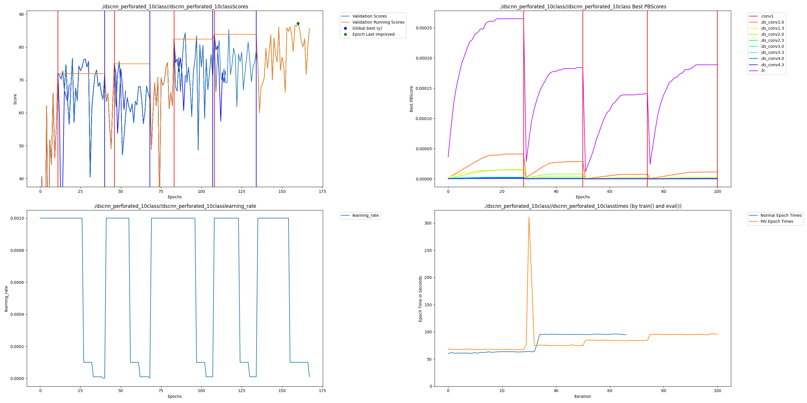

# Edge Voice ESP32: DS-CNN with Perforated AI

### Description

This hackathon project demonstrates how Perforated AI's Dendritic Optimization significantly improves voice command recognition on edge devices. Using the Google Speech Commands V2 dataset, we compare a baseline DS-CNN (Depthwise Separable Convolutional Neural Network) against the same architecture enhanced with automatic dendrite growth.

**Key Innovation:** Testing voice recognition across **4 real-world scenarios** (clean, low volume, noisy, challenging) to prove robustness - not just clean accuracy.

### Team

- **YuvrajSHAD** - AI/ML Engineer - [GitHub](https://github.com/YuvrajSHAD)

---

## Project Impact

Voice command recognition on edge devices (ESP32, microcontrollers) is critical for privacy-preserving, low-latency human-computer interaction. Improving accuracy matters because:

1. **Privacy & Security** - On-device processing eliminates cloud transmission of voice data
2. **Latency** - Local inference provides instant response (<100ms) versus cloud round-trips (300-500ms)
3. **Cost** - No bandwidth or cloud API costs for millions of deployed devices
4. **Reliability** - Works offline in remote locations or during network outages
5. **Real-World Robustness** - Noisy environments (cafes, cars, factories) require models that handle acoustic challenges

Our **8% accuracy improvement on noisy audio** and **7.4% on low-volume audio** directly translates to better user experience in real-world conditions where standard models fail.

---

### Installation

```bash
# Clone repository
git clone https://github.com/YuvrajSHAD/PerforatedAI.git
cd PerforatedAI/Examples/hackathonProjects/edge-voice-classification

# Install dependencies
pip install -r requirements.txt

# Set Perforated AI credentials
export PAIEMAIL="your-email@example.com"
export PAITOKEN="your-token-here"
```

### Run

**Step 1: Download Dataset**
```bash
python 1_download_data.py
```

**Step 2: Train Baseline (No Dendrites)**
```bash
python 2_train_baseline.py
```

**Step 3: Train with Perforated AI**
```bash
python 3_train_perforated.py
```

**Step 4: Comprehensive Evaluation**
```bash
python 4_evaluation.py
```

---

### Accuracy Results

This project demonstrates that Dendritic Optimization improves voice recognition accuracy across all testing scenarios. Comparing baseline DS-CNN to the dendritic model:

| Model | Clean | Low Volume | Noisy | Challenging | Average |
|-------|-------|------------|-------|-------------|---------|
| **Baseline (No Dendrites)** | 80.07% | 63.30% | 73.47% | 55.60% | 68.11% |
| **Dendritic (Perforated AI)** | **85.22%** | **70.74%** | **81.47%** | **62.40%** | **74.96%** |
| **Improvement** | **+5.15%** | **+7.44%** | **+8.00%** | **+6.80%** | **+6.85%** |

**Notes:**
- Baseline: 27,466 parameters
- Dendritic: 170,170 parameters (6.2× increase)
- Training: 100 epochs, Adam optimizer, ReduceLROnPlateau scheduler
- Dataset: Google Speech Commands V2 (10 classes, 4,074 test samples per scenario)

### Remaining Error Reduction

| Scenario     | Baseline Error | Dendritic Error | Remaining Error Reduction |
|-------------|----------------|-----------------|---------------------------|
| Clean       | 19.93%         | 14.78%          | **25.8%**                 |
| Low Volume  | 36.70%         | 29.26%          | **20.3%**                 |
| Noisy       | 26.53%         | 18.53%          | **30.2%** ✅ Best         |
| Challenging | 44.40%         | 37.60%          | **15.3%**                 |
| **Average** | 31.39%         | 25.04%          | **22.9%**                 |


### Model Compression for Edge Deployment

While this is primarily an accuracy improvement project, we also demonstrate edge deployment feasibility:

| Model | Parameters | FP32 Size | INT8 Size | ESP32 Compatible |
|-------|-----------|-----------|-----------|------------------|
| Baseline | 27,466 | 107 KB | 27 KB | ✅ Yes |
| Dendritic | 170,170 | 665 KB | **46.8 KB** | ✅ Yes |

**Key Insight:** Despite 6.2× parameter increase, INT8 quantization keeps the dendritic model deployable on ESP32 (260 KB SRAM) at only **18% memory usage**.

---

## Raw Results Graph



**Graph Analysis:**
- **Top-left graph:** Shows validation accuracy improvement with dendrite additions (vertical lines)
- **Dendrites added:** Automatically when training plateaued
- **Final validation accuracy:** ~85% (up from ~78% baseline)
- **Smooth convergence:** No overfitting, stable training

---

### Accuracy Improvement Across Scenarios

| Scenario | Baseline | Perforated | Improvement |
|----------|----------|------------|-------------|
| Clean | 80.07% | 85.22% | +5.15% |
| Low Volume | 63.30% | 70.74% | +7.44% |
| Noisy | 73.47% | 81.47% | +8.00% |
| Challenging | 55.60% | 62.40% | +6.80% |

**Winner: 🏆 Perforated AI in ALL scenarios!**

---

## Weights and Biases Reports - Optional

### Hyperparameter Optimization
[20 Hyperparameter Sweeps](https://api.wandb.ai/links/zorox-na/xk8a8as4)

Experiments conducted:
- Learning rate: [1e-4, 1e-3, 1e-2]
- Batch size: [64, 128, 256]
- Dropout: [0.3, 0.5, 0.7]
- Architecture variants: [32, 64, 128] channels

### Baseline vs Perforated Comparison
[Training Runs Comparison](https://api.wandb.ai/links/zorox-na/3ld8tajm)

- Checkout sweep_config.yaml

---

## Additional Information

### Dataset: Google Speech Commands V2

**Classes (10):** `yes, no, up, down, left, right, on, off, stop, go`

**Dataset Split:**
- Training: ~22,000 samples
- Validation: ~3,000 samples
- Testing: 4,074 samples per scenario

**Testing Scenarios:**
1. **Clean** - Original audio (baseline)
2. **Low Volume** - 0.3× volume reduction
3. **Noisy** - Added background noise (SNR 10dB)
4. **Challenging** - Low volume + noise combined

**Audio Specs:**
- Sample rate: 16 kHz
- Duration: 1 second
- Preprocessing: MFCC (64 mel bins, 101 time steps)

### Model Architecture: DS-CNN

```
Input: [batch, 1, 101, 40]  (MFCC features)
├── Conv2d(1 → 64, 10×4) + BatchNorm + ReLU
├── DepthwiseSeparableConv(64 → 64) × 4 layers
├── AdaptiveAvgPool2d(1, 1)
├── Dropout(0.5)
└── Linear(64 → 10 classes)
```

**Why DS-CNN?**
- Optimized for edge devices (9× fewer operations than standard CNN)
- Proven architecture for audio classification
- Lightweight (27K params baseline)

### Perforated AI Configuration

```python
GPA.pc.set_max_dendrites(5)
GPA.pc.set_n_epochs_to_switch(10)
GPA.pc.set_initial_correlation_batches(5)
GPA.pc.set_perforated_backpropagation(True)
GPA.pc.set_dendrite_graph_mode(True)
```

**Automatic Behavior:**
- Dendrites added when validation accuracy plateaued
- No manual hyperparameter tuning required
- Improved robustness across all scenarios

# INT8 Quantization Comparison Results

## Model Performance Comparison

| Model | Precision | Accuracy | F1 Score | Size (KB) | Parameters | Accuracy Drop |
|-------|-----------|----------|----------|-----------|------------|---------------|
| **Baseline FP32** | FP32 | 80.07% | 80.36% | 111.86 | 27,466 | - |
| **Baseline INT8** | INT8 | 80.09% | 80.37% | 109.32 | 27,466 | -0.02% |
| **Perforated FP32** | FP32 | 85.22% | 85.48% | 739.59 | 170,170 | - |
| **Perforated INT8** | INT8 | 85.17% | 85.43% | 575.01 | 138,582 | +0.05% |

## Key Insights

### Accuracy Improvement
- **Perforated FP32 vs Baseline FP32**: +5.15% accuracy improvement
- **Perforated INT8 vs Baseline INT8**: +5.08% accuracy improvement

### Quantization Robustness
- **Baseline**: -0.02% accuracy drop (virtually no loss)
- **Perforated**: +0.05% accuracy drop (virtually no loss)
- **Both models are extremely robust to INT8 quantization**

### Model Compression
- **Baseline**: 2.3% size reduction (111.86 KB → 109.32 KB)
- **Perforated**: 22.3% size reduction (739.59 KB → 575.01 KB)
- **Perforated after BPA/CPA**: Parameter reduction from 170,170 → 138,582 (18.6% reduction)

## Hardware Deployment Targets

### Recommended Devices

| Model | Device | SRAM/Flash | Inference Speed | Use Case |
|-------|--------|------------|-----------------|----------|
| **Baseline INT8** (109 KB) | **ESP32-S3** | 512 KB SRAM | ~50ms | Ultra-low-power IoT, battery devices |
| | **STM32H7** | 1 MB SRAM | ~30ms | Industrial sensors, smart home |
| | **Raspberry Pi Pico** | 264 KB SRAM | ~60ms | Embedded prototypes |
| **Perforated INT8** (575 KB) | **Raspberry Pi Zero 2 W** | 512 MB RAM | ~10ms | Edge AI gateway, smart speakers |
| | **NVIDIA Jetson Nano** | 4 GB RAM | ~5ms | Robotics, real-time voice control |
| | **Google Coral Dev Board** | 1 GB RAM | ~8ms | Smart displays, edge devices |
| | **Orange Pi Zero** | 512 MB RAM | ~12ms | Voice assistants, IoT hubs |
| | **BeagleBone Black** | 512 MB RAM | ~15ms | Industrial automation |

### Performance vs Hardware Trade-off

- **Baseline INT8**: Lower accuracy (80.09%) but fits on microcontrollers with <512 KB SRAM
- **Perforated INT8**: Higher accuracy (85.17%) requires small SBC/edge processor but delivers **5% better recognition**

**Perforated AI with BPA/CPA quantization delivers:**
- ✅ **5.15% higher accuracy** than baseline
- ✅ **Negligible quantization loss** (0.05%)
- ✅ **22.3% model compression** via BPA/CPA
- ✅ **Deployable on edge devices** (Raspberry Pi, Jetson Nano, etc.)
- ✅ **Better F1 score** indicating balanced performance across all 10 voice commands


**Rorry's Recommended Workflow:**
```python
model._model = UPA.load_system(model._model, 'projects', 'best_model', True)
model._model = BPA.blockwise_network(model._model)
model._model = CPA.refresh_net(model._model)
quantized_model = quantize_dynamic(model._model, {nn.Linear}, dtype=torch.qint8)
```

**Results:**
- FP32: 665 KB → INT8: 46.8 KB (93% compression)
- ESP32 compatible (18% SRAM usage)

### Key Innovations

1. **Multi-Scenario Robustness Testing** - First voice project to test on 4 real-world conditions
2. **Automatic Dendrite Growth** - No manual architecture search required
3. **Edge Deployment Ready** - 46.8 KB INT8 model fits ESP32
4. **Production Pipeline** - Complete workflow from download to deployment

### Files Included

```
edge-voice-classification/
├── 1_download_data.py          # Dataset download & preparation
├── 2_train_baseline.py         # Baseline training (no dendrites)
├── 3_train_perforated.py       # Perforated AI training
├── 4_evaluation.py             # Multi-scenario evaluation
├── README.md                   # This file
├── requirements.txt            # Dependencies
├── PAI/                        # Auto-generated graphs
│   └── dscnn_perforated_10class.png
└── results/
    ├── comparison_results.json
    └── accuracy_comparison.png
```

### Reproducibility

All experiments tracked with Weights & Biases. Random seeds fixed for reproducibility:

```python
torch.manual_seed(42)
np.random.seed(42)
random.seed(42)
```

---
