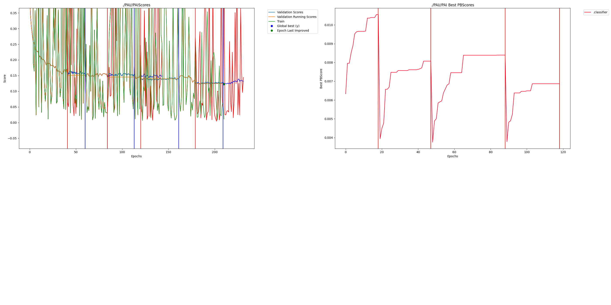

# EfficientNet Hackathon Project

## Intro

EfficientNet is a family of convolutional neural networks (CNNs) for Image Classification created by researchers at Google AI in 2019.
https://en.wikipedia.org/wiki/EfficientNet  
https://arxiv.org/abs/1905.11946

This hackathon submission tests adding dendrites to EfficientNet.  

For this hackathon EfficientNet B7 was trained and tested on a small inferred dataset containing 4000 images annotated for various **plastic types**.  
The dataset was split into:  
- 3600 training dataset (2880 training images, 720 validation images)
- 400 test images

### Team:

Eddi - Head of IT, Lasso Loop Recycling Ltd  
https://lassoloop.com  
https://www.linkedin.com/company/lassoloop  
ed@lassoloop.com

## Project Impact

Lasso is the world’s first at-home recycling solution. Every item you insert into your Lasso is scanned, washed, broken down, and stored individually with like materials, which can then be effectively re-used to create new items or containers like PET bottles, aluminium cans, etc.

The materials need to be of a very high purity to be able to be re-used. It is paramount that, for example, PET plastic is not mixed with HDPE plastic, or even, green glass not get mixed with brown/amber glass.
This is where Image Recognition AI models and PerforatedAI come in. By capturing an image of the item and using it for image classification AI models, the item's material type and other characteristics can be inferred or identified, allowing an acceptance decision for recycling to be made.  
High accuracy of the AI models is of utmost importance.  

## Public Commitment

- [Announcement post](https://www.linkedin.com/posts/lassoloop_were-thrilled-to-announce-we-have-been-selected-activity-7417677582273507329-4fUk)
- [Results post](https://www.linkedin.com/posts/lassoloop_our-first-perforatedai-results-are-in-activity-7418698693568200704-vtvi)

## Usage Instructions

Dataset:  
This project uses an inferred dataset where sub-folders are the labels and contain the images for that label.
The dataset should contain correctly sized images for the chosen efficientnet version.  
https://keras.io/examples/vision/image_classification_efficientnet_fine_tuning/

Installation:

    pip install -r requirements.txt

Run:

    PAIPASSWORD=123 python efficientnet_perforatedai.py --path-dataset /path/to/training_dataset/

Run with specific EfficientNet version/variant (0-7):

    PAIPASSWORD=123 python efficientnet_perforatedai.py --path-dataset /path/to/training_dataset/ --efficientnet-version 7

## Results

For this project 2 models were trained to minimize loss, after which both models were tested on the 400 test images, 
delivering the models accuracy, inference duration, errors, and certainty of each prediction.  
Model descriptions:

1. Our Pytorch EfficientNetB7 implementation containing hyperparameter tweaks.
2. The basic Pytorch EfficientNetB7 with PerforatedAI dendrites implementation from this example (see `./efficientnet_perforatedai.py`).

The test results show that Dendritic Optimization can improve accuracy on a small dataset. 
Comparing the best pytorch model to the best dendritic model below:

| Model        | Final Test Score | Notes                              |
|--------------|------------------------|------------------------------------|
| Pytorch      | 65.5                   | Pytorch model with tweaks          |
| PerforatedAI | 72.5                   | Basic PerforatedAI implementation  |

This provides a Remaining Error Reduction of **20%**.

The results of the tests can be found in this project (see below).

## Raw Results Graph

## Clean Results Graph

## Additional Files

- `./test-results/pytorch_model_test_results.csv`: list of prediction results of the pytorch model test
- `./test-results/pytorch_model_test_results_summary.json`: summary of the pytorch model test
- `./test-results/perforatedai_model_test_results.csv`: list of prediction results of the PerforatedAI model test
- `./test-results/perforatedai_model_test_results_summary.json`: summary of the PerforatedAI model test