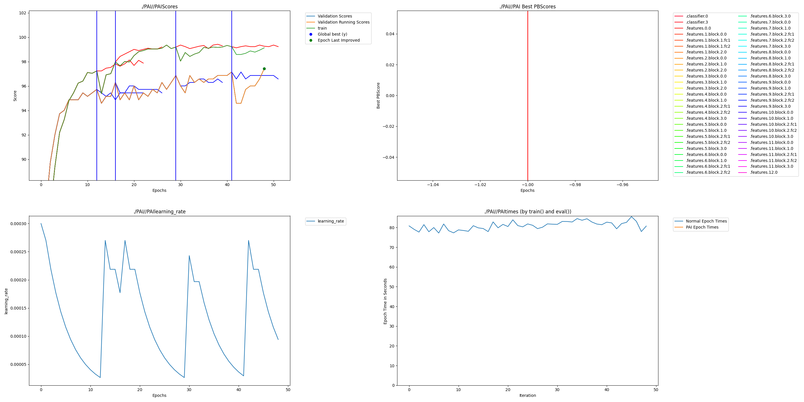

# Fruit & Veg Dendritic Optimization for Street-Level POS (MobileNetV3)

## Intro

This repository contains a complete submission for the PyTorch Dendritic Optimization Hackathon using PerforatedAI.

I am the Lead AI Engineer at Quantilytix, and this project applies dendritic optimization to a grounded, real-world computer vision problem: fruit and vegetable recognition as a building block for street-level point-of-sale and inventory systems.

### Project EdgeVision POS
The core idea is simple and practical. A mobile phone camera becomes the POS interface for informal vendors. Incoming stock is scanned visually. Items are scanned again at the point of sale. Inventory and sales records are generated automatically, without barcodes, fixed infrastructure, or complex workflows.

The submission includes two controlled experiments using the same backbone architecture:
- A baseline MobileNetV3-Small model without dendrites
- A dendritically optimized version using PerforatedAI’s library

All architectural changes related to dendrites are implemented using PerforatedAI’s required APIs, including initialize_pai() and add_validation_score(), making this a clean and reproducible comparison.

## Project Impact

Informal retail serves billions of people, yet most POS systems assume internet access, literacy, and fixed catalogs that do not exist in street markets. This work treats the phone camera as the POS interface itself: vendors photograph produce, an on-device model recognizes items offline, and transactions occur without connectivity or predefined SKUs. The challenge is making vision models small and adaptable enough for local deployment, proving that the camera vendors already have can replace POS systems they cannot afford or maintain.

A vision-based POS system lowers the barrier to entry dramatically. Vendors do not need SKUs or scanners. They already have smartphones. What they need is a model that is accurate, lightweight, and robust to real-world conditions such as uneven lighting, cluttered backgrounds, partial occlusion, and camera noise.

A vision-based POS system lowers the barrier to entry:

	•	No SKUs or barcode scanners required
	
	•	Runs on commodity smartphones
	
	•	Minimal training overhead for vendors

The core idea is practical. A mobile phone camera becomes the POS interface for informal vendors:

	• scan inventory in 
	
	• scan sales out
	
	• This removes the need for barcodes, fixed infrastructure, or rigid product catalogs.
	
	• Automatic record keeping.

This is where dendritic optimization becomes interesting. Rather than scaling up the backbone or increasing parameter count aggressively, dendrites offer a way to extract more expressive power from a compact architecture. For edge deployment, latency, cost, and battery constraints matter. Improving accuracy without bloating the model directly impacts feasibility in real deployments.

This project demonstrates that dendritic optimization can deliver meaningful accuracy gains in exactly this kind of constrained, real-world setting.

## Usage Instructions

The repository provides two runnable training scripts and two notebooks:

- fruitveg_original.py  
  Baseline MobileNetV3-Small without dendrites

- fruitveg_perforatedai_pathA.py  
  MobileNetV3-Small with dendritic optimization using PerforatedAI (Path A, GD dendrites)

- Both notebooks runnable on Kaggle. (Kaggle-Notebooks)

- Requirement.txt

- PerforatedAI-generated results graph

### Installation

pip install -r requirements.txt

### Run Baseline

python fruitveg_original.py

### Run Dendritic Model

python fruitveg_perforatedai_pathA.py --dendrite-mode 1

### Dataset Paths

The default dataset paths are configured for Kaggle:

https://www.kaggle.com/datasets/kritikseth/fruit-and-vegetable-image-recognition

- /kaggle/input/fruit-and-vegetable-image-recognition/train  
- /kaggle/input/fruit-and-vegetable-image-recognition/validation  
- /kaggle/input/fruit-and-vegetable-image-recognition/test  

The dendritic training script uses PerforatedAI’s required APIs, including:
- UPA.initialize_pai(...)
- GPA.pai_tracker.add_validation_score(...)

## Results

This submission is accuracy-focused, with a direct baseline versus dendritic comparison using the same architecture and training setup.

| Metric | Traditional (no dendrites) | Dendritic (PerforatedAI Path A, GD dendrites) |
|--------|---------------------------|-----------------------------------------------|
| **Validation Accuracy** | 95.16% (MobileNetV3-Small fine-tuned) | 97.44% (Four dendrites added) |
| **Test Accuracy** | 95.26% | 97.49% |
| **Error Rate** | 4.84% | 2.56% |
| **Remaining Error Reduction (RER)** | — | 47.1% |

**RER Calculation:**
- Baseline error: 100 - 95.16 = 4.84
- Dendritic error: 100 - 97.44 = 2.56
- RER: (4.84 - 2.56) / 4.84 = **47.1%**

In practical terms, dendritic optimization eliminated approximately 47% of the baseline model’s remaining validation error without changing the backbone architecture.

## Raw Results Graph

The PerforatedAI-generated results graph is included as part of the submission and is the primary verification artifact for dendrite integration and training behavior.

The graph is generated automatically by the PerforatedAI library and saved at:

## Weights and Biases Sweep Report

Not included. This project was executed as a direct, controlled comparison between a baseline model and its dendritically optimized counterpart to produce a clear, reproducible result.

These files are provided for inspection and convenience. The full experiment is reproducible from the scripts and dataset paths described above.

## Takeaway

This experiment demonstrates that dendritic optimization can meaningfully improve compact vision models under realistic constraints. For applications like informal retail, where models must be small, robust, and deployable without infrastructure—this approach offers a promising alternative to brute-force scaling.

In future iterations, this work can extend to:
	•	On-device incremental learning
	•	Multi-modal inputs (vision + audio transactions)
	•	Real-time inventory reconciliation for informal markets
