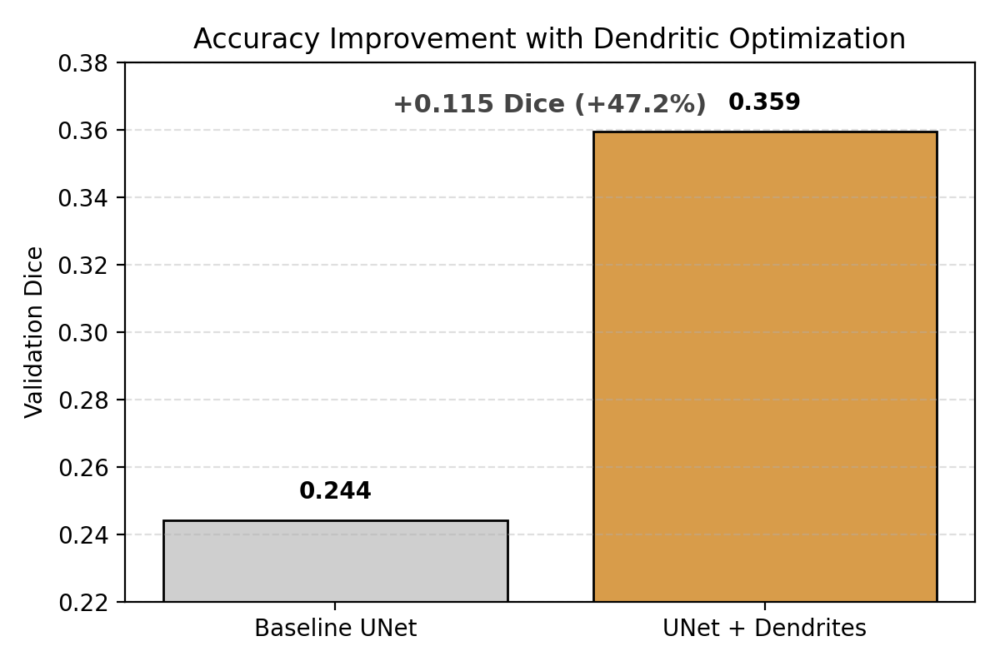
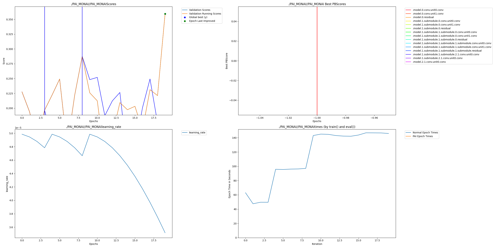
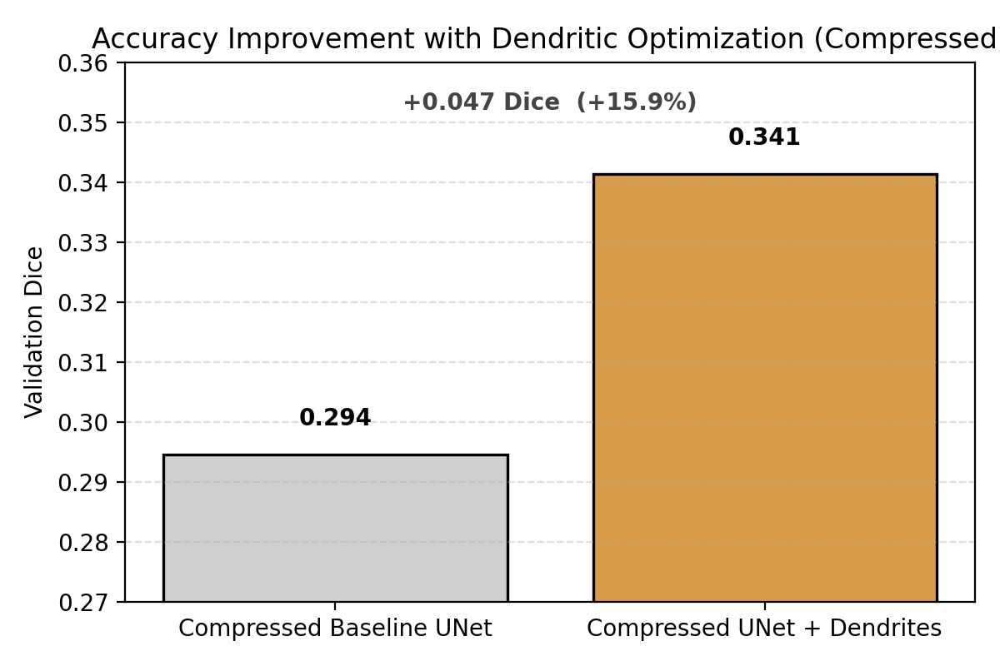

# Perforated-MONAI: Dendritic Optimization for 3D UNet Segmentation

## 1. Overview
This example demonstrates dendritic optimization applied to a 3D MONAI UNet
for multi-class medical image segmentation. We compare baseline and compressed
models trained with and without dendrites to evaluate accuracy improvements
under different capacity constraints.

---

## 2. Dataset
- Dataset: MONAI open-source 3D multi-class medical image segmentation dataset  
- Input channels: 4  
- Output classes: 4  

The dataset is automatically downloaded by MONAI or can be specified via a
configurable data directory.
data download https://msd-for-monai.s3-us-west-2.amazonaws.com/Task01_BrainTumour.tar (extract with winrar)
keep the data in root folder Perforated-MONAI\datasets\monai\Task01_BrainTumour

---

## 3. Installation & Usage
Clone the repository and install dependencies:

cd perforated_monai_3d_unet
git clone https://github.com/PerforatedAI/PerforatedAI.git

Install dependencies
pip install -r requirements.txt

# Train baseline
python src/training/train_baseline.py
python src/training/train_baseline_compressed.py

# Train dendritic
python src/training/train_dendritic_old.py
python src/training/train_dendritic_old_compressed.py

## 4. Results

For fair comparison, we report the **best validation Dice score achieved during training** for each model.  
This is necessary because dendritic optimization intentionally explores architectural variants and does not improve monotonically.

---

### Experiment A — Full-Capacity UNet

**Validation Dice Scores**
- Baseline UNet: ~0.2441  
- UNet + Dendrites: ~0.3593  

This corresponds to a **relative Dice improvement of ~47.3%** over the baseline model, despite the base architecture already having high capacity.

#### Perforated AI Raw Results Graph (Required)
The following graph is **automatically generated by the Perforated AI library** and confirms correct dendrite activation and structural convergence.

**Observations**
- ~2 dendrites were automatically added
- Accuracy improved without increasing base model size
- Confirms dendrites benefit even strong, non-compressed models

---

### Experiment B — Compressed UNet

**Validation Dice Scores**
- Compressed Baseline UNet: ~0.2945  
- Compressed UNet + Dendrites: ~0.3414  

This corresponds to a **relative Dice improvement of ~15.9%**, demonstrating that dendritic optimization can recover accuracy lost due to architectural compression.

#### Perforated AI Raw Results Graph (Required)
This graph verifies dendritic growth and convergence for the compressed model.

**Observations**
- Dendrites activated automatically under capacity constraints
- A significant portion of lost accuracy was recovered
- Multiple dendritic growth cycles were evaluated before convergence

---

## Project Impact

Accurate 3D medical image segmentation is critical for clinical workflows such as tumor delineation, treatment planning, and disease monitoring. However, high-performing 3D models are computationally expensive and difficult to deploy in real-world hospital environments.

This project demonstrates that dendritic optimization can improve segmentation accuracy in already strong models and recover accuracy lost due to architectural compression—without manual redesign. This enables more accurate models to be deployed on constrained hardware, reducing inference cost while maintaining clinical usability.
