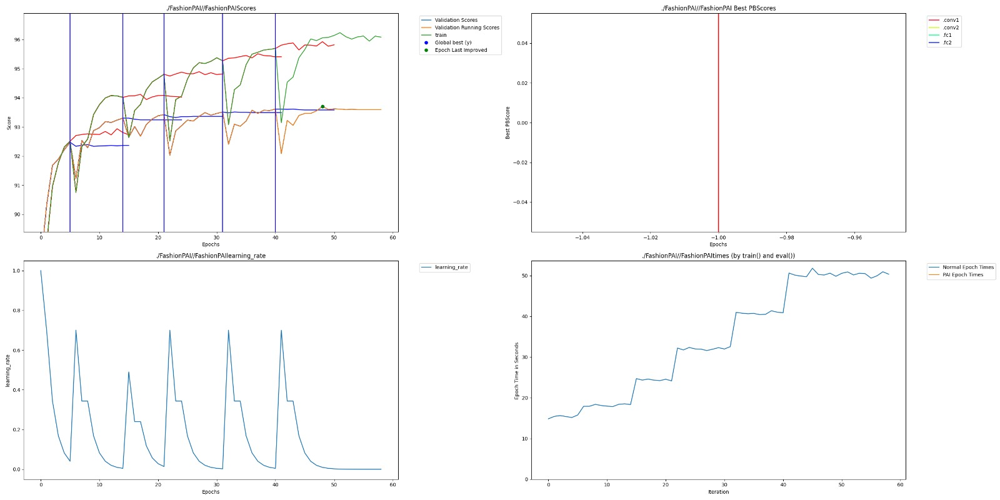
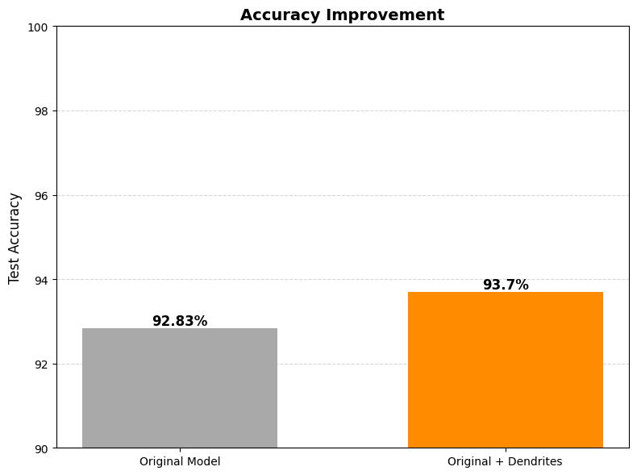

# Dendritic Optimization for Enhanced Image Classification: A Fashion-MNIST Case Study

## Intro - Required

This folder contains a submission for the Perforated AI hackathon. The project demonstrates the application of Dendritic Optimization, implemented via the Perforated AI library, to enhance the performance of a Convolutional Neural Network (CNN) on the Fashion-MNIST image classification task. Fashion-MNIST is a dataset of Zalando's article images, consisting of 70,000 grayscale images in 10 categories, serving as a more complex benchmark than the original MNIST dataset. This submission includes a baseline CNN model and a dendritically-optimized model, with results and analysis.

### Team:

- Shobhit
- Agastya

## Project Impact - Required

Improving image classification accuracy on datasets like Fashion-MNIST has significant real-world implications. In e-commerce, accurate automated tagging and visual search systems enhance user experience, increase conversion rates, and streamline inventory management by reliably identifying products. For instance, distinguishing between visually similar items like different types of apparel reduces customer frustration and minimizes lost sales. Beyond retail, advancements in classification techniques underpin critical applications in fields such as medical imaging, where accurate diagnosis from visual data directly impacts patient outcomes, and in autonomous systems, where reliable object detection is paramount for safety. The "remaining error reduction" achieved by techniques like Dendritic Optimization translates to more robust AI systems, reducing the need for manual intervention, lowering operational costs, and enabling new applications where higher precision is essential. This project aims to contribute to the pursuit of more accurate and efficient AI vision models.

## Usage Instructions - Required

Each project must include instructions for how to install and run the project.

### Installation:

1. Clone the repository and navigate to the project directory:
```bash
git clone <your-repo-url>
cd <path-to-your-project-folder>
```

2. Create and activate a Python virtual environment (recommended):
```bash
python -m venv venv
# On Windows:
# venv\Scripts\activate
# On macOS/Linux:
# source venv/bin/activate
```

3. Install dependencies:
```bash
pip install -r requirements.txt
```

4. Configure Weights & Biases (wandb):
```bash
wandb login
```
Follow the prompts to authenticate with your wandb account.

5. Set Perforated AI Credentials (if applicable):
   - If using a licensed version of the Perforated AI library, set the necessary environment variable (e.g., PAIPASSWORD). The method for this may vary based on your license type.
   - For PowerShell (Windows):
```powershell
$env:PAIPASSWORD="your_pai_password_here"
```
   - For bash (Linux/macOS):
```bash
export PAIPASSWORD="your_pai_password_here"
```
```

### Run:

#### Baseline Model (Standard CNN):
This script trains a standard CNN on Fashion-MNIST without Dendritic Optimization.
```bash
python fashion_mnist_original.py [--epochs N] [--no-cuda]
```

Example (CPU, 15 epochs):
```bash
python fashion_mnist_original.py --epochs 15 --no-cuda
```

Example (GPU, 20 epochs):
```bash
python fashion_mnist_original.py --epochs 20
```

Use `python fashion_mnist_original.py --help` for all available options.

#### Dendritically-Optimized Model (with Weights & Biases Sweep):
This script uses the Perforated AI library to apply Dendritic Optimization and leverages Weights & Biases for hyperparameter sweeping.
```bash
python fashion_mnist_perforatedai_wandb.py --use-wandb [--count N] [--no-cuda]
```

Example (CPU, 25 sweep runs):
```bash
python fashion_mnist_perforatedai_wandb.py --use-wandb --count 25 --no-cuda
```

Example (GPU, 50 sweep runs):
```bash
python fashion_mnist_perforatedai_wandb.py --use-wandb --count 50
```

The `--use-wandb` flag is crucial for initiating the sweep. The `--count N` specifies the number of individual training runs (agents) for the sweep. The Perforated AI library will automatically generate output graphs (e.g., `PAI/PAI.png` or `PAI/<save_name>.png`) in the project directory.

## Results - Required

This project demonstrates that Dendritic Optimization can improve classification accuracy on the Fashion-MNIST dataset. The results compare the performance of a standard, fully-trained baseline CNN against the best-performing dendritically-optimized CNN discovered through a Weights & Biases hyperparameter sweep.

### Baseline Model (Standard CNN):

- **Final Validation Accuracy:** 92.84%
- **Configuration:** Trained for 15 epochs using `fashion_mnist_original.py` on CPU. The command used was `python fashion_mnist_original.py --epochs 15 --no-cuda`. The final reported "Best Test Accuracy" was 92.84%.

### Dendritically-Optimized Model (Best from Sweep):

- **Final Validation Accuracy:** 93.70%
- **Configuration:** Achieved via one of the runs in the wandb sweep using `fashion_mnist_perforatedai_wandb.py`. This specific run utilized Gradient Descent Dendrites (as indicated by "Building dendrites without Perforated Backpropagation" in logs, implying dendrite_mode=1), reached a maximum of 5 dendrites, and trained for a total of 116 epochs before the Perforated AI system determined training_complete. The final "Best Val Acc" reported by the Perforated AI system was 93.70%. The parameter count for this architecture was 112,539.

### Remaining Error Reduction (RER):

- **Baseline Error:** 100% - 92.84% = 7.16%
- **Dendritic Model Error:** 100% - 93.70% = 6.30%
- **Error Reduction:** 7.16% - 6.30% = 0.86%
- **Remaining Error Reduction:** (0.86% / 7.16%) * 100% ≈ 12.01%

This indicates that Dendritic Optimization eliminated approximately **12.01%** of the errors made by the baseline model.

### Results Summary:

| Model Type | Final Validation Score | Notes |
|------------|------------------------|-------|
| Standard Baseline CNN | 92.84% | Trained for 15 epochs. |
| Dendritically-Optimized CNN | 93.70% | Best model from wandb sweep; used Gradient Descent Dendrites; 5 dendrites added; 116 epochs; Param Count: 112,539. |

## Raw Results Graph - Required

The following graph, `FashionPAI/PAI.png`, was automatically generated by the Perforated AI library during the best-performing run of the dendritically-optimized model. It provides a detailed view of the training dynamics, including validation scores, training scores, learning rate adjustments, and timing information.



The top-left subplot (`./PAI//PAIScores`) is particularly important as it shows the validation accuracy over epochs. The distinct "steps" or "impulse blocks" in this curve correspond to phases where dendrites were added to the model, leading to performance improvements. Vertical lines mark restructuring events. This graph is mandatory for verifying that the Dendritic Optimization process was active and effective. The "Training complete" message and the final "Best Val Acc: 93.70%" are also associated with this graph's generation.

## Clean Results Graph - Optional

The following bar chart provides a clear, condensed visualization of the accuracy improvement achieved by Dendritic Optimization compared to the standard baseline CNN.



This graph clearly illustrates the gain from 92.84% (Baseline) to 93.70% (Dendritic).

## Weights and Biases Sweep Report 

A comprehensive Weights & Biases sweep report is available, detailing the outcomes of all experiments conducted during the hyperparameter search for the dendritically-optimized model. This report provides clear visuals, including parallel coordinates plots and summary tables, showing how different hyperparameters (including `dropout`, `weight_decay`, `improvement_threshold`, `pai_forward_function`, `dendrite_mode`, and `width`) influenced the model's validation accuracy, parameter count, and dendrite count.

**Weights and Biases Report:** [Link](https://api.wandb.ai/links/shobhit1kapoor-university-of-texas-at-dall/2h2rv93d)

## Use Cases & Business Value
This project demonstrates how Dendritic Optimization can be applied to solve real-world retail challenges:

- Mobile Visual Search: Enhances image classification accuracy for retail apps, helping users find products via camera search and reducing lost sales due to mismatches.
- Edge AI Deployment: Optimizes the trade-off between accuracy and model size, allowing high-performance visual search to run on-device (smartphones, scanners) without cloud latency.
- Cold-Start Scenarios: Leverages bio-inspired architectures to generalize better on limited data, enabling faster deployment of new fashion lines with fewer training examples.